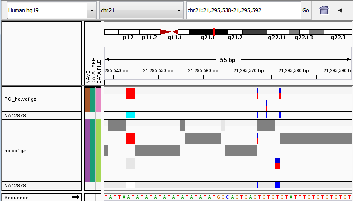

Reference Graphs
================

Reference graphs are used to represent alternative haplotypes (there is 
ambiguity in case of unknown phasing).

A reference graph gives alternative sequences on a fixed chromosome.

Node Data
---------

Each node stores information on

* its start and end on the chromosome (reference coordinates)
* a list of reference modifications (alternative sequences)
* a type (see below)
* optionally, a color (for phasing)

Node Types
----------

*  **Unknown**: no variance information is known (when getting sequence for 
   this, we will assume that the sequence is equal to the reference, but we may
   treat these regions differently in comparison / reporting results).
*  **Homref**: the sequence is equal to the genome reference
*  **Alt**: There is an alternative sequence which is different from the 
   reference in this region.

Node Colors
-----------

Node colors are used to restrict the paths we traverse in the graph for phased
comparisons.

*  Red: Node is likely phased to maternal (left in VCF) haplotype
*  Blue: Node is likely phased to paternal (right in VCF) haplotype
*  Black: Node is present on all haplotypes.
*  Grey: Phasing of node is unknown, but it is not present on all of them 
   (unphased het).

Edges
-----

We allow edges between nodes $n_1$ and $n_2$ if $start(n_2) > end(n_1)$. Edges
may carry additional information derived from the variant records (e.g. variant
quality / GQX), or e.g. from BAM files / read alignments / assemblies.

Example
-------

The track for `hc.vcf.gz` in this screenshot:



... generates this graph


Debugging Reference Graphs
--------------------------

This package includes the `hapenum` tool, which can generate dot files for
VCF regions (input must be gzipped+tabixed):

```bash
${hap.py}/bin/hapenum -r reference.fasta input.vcf.gz \
    --output-dot graph.dot -l chr1:1-1000 && dot -Tsvg graph.dot > graph.svg
```
